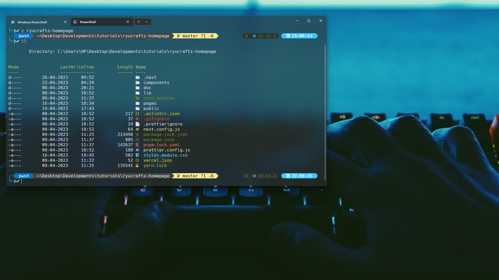

# Vaibhav's dotfiles

**Warning**: Don’t blindly use my settings unless you know what that entails. Use at your own risk!

## Contents

- vim (NeoVim) config
- tmux config
- git config
- fish config
- PowerShell config

## Neovim setup

1. **Install Neovim**: Ensure you have [Neovim](https://neovim.io/) (>= 0.8) installed.

2. **Plugin Manager**: Install [wbthomason/packer.nvim](https://github.com/wbthomason/packer.nvim) as your plugin manager.

3. **Create Config File**: Edit `~/.config/nvim/init.vim` or `~/.config/nvim/init.lua`.

4. **Install Plugins**: Use Packer.nvim to install plugins. Run `:PackerInstall` in Neovim.

5. **Configure Plugins**: Set up each plugin as per its documentation in your config file.

6. **LSP Servers**: Use [williamboman/mason.nvim](https://github.com/williamboman/mason.nvim) and [williamboman/mason-lspconfig.nvim](https://github.com/williamboman/mason-lspconfig.nvim) to manage LSP servers.

7. **Fonts**: Install required fonts for icons, if needed.

8. **Markdown Preview**: Configure [iamcco/markdown-preview.nvim](https://github.com/iamcco/markdown-preview.nvim) if you want Markdown live preview.

9. **Test & Enjoy**: Restart Neovim and test your setup. Customize as needed.

## PowerShell setup (Windows)

- [Scoop](https://scoop.sh/) - A command-line installer
- [Git for Windows](https://gitforwindows.org/)
- [Oh My Posh](https://ohmyposh.dev/) - Prompt theme engine
- [Terminal Icons](https://github.com/devblackops/Terminal-Icons) - Folder and file icons
- [PSReadLine](https://docs.microsoft.com/en-us/powershell/module/psreadline/) - Cmdlets for customizing the editing environment, used for autocompletion
- [z](https://www.powershellgallery.com/packages/z) - Directory jumper
- [PSFzf](https://github.com/kelleyma49/PSFzf) - Fuzzy finder

